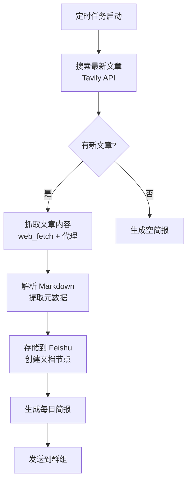

# Blog Explorer Agent

## 概述

专门负责抓取、解析和存储 AI 公司博客内容的独立 agent。

## 功能特性

✅ **自动化博客监控**
- 监控 OpenAI、Anthropic、LangChain、Manus 的博客更新
- 每日自动检查新文章
- 智能过滤重复内容

✅ **智能内容抓取**
- 使用 Tavily API 搜索最新文章
- 通过代理（localhost:7890）使用 web_fetch 抓取完整内容
- 自动提取元数据（标题、发布时间、摘要、标签）

✅ **结构化存储**
- 存储到 Feishu 知识库（空间ID: 7606015010138590169）
- 按公司分类：OpenAI、Anthropic、LangChain、Manus
- 按日期命名：YYYY-MM-DD-文章标题.md

✅ **每日简报生成**
- 汇总当日所有新文章
- 提取关键信息和链接
- 发送到 Feishu 群组

## 目标博客

| 公司 | 博客地址 | 搜索查询 |
|------|----------|----------|
| OpenAI | https://openai.com/blog | `site:openai.com/blog` |
| Anthropic | https://www.anthropic.com/blog | `site:anthropic.com/blog OR site:anthropic.com/news` |
| LangChain | https://blog.langchain.com | `site:blog.langchain.com` |
| Manus | https://www.manus.ai/blog | `site:manus.ai/blog OR site:manus.im/blog` |

## 工作流程



## 存储结构

### Feishu 知识库

```
知识库空间: 7606015010138590169
├── AI公司博客/
│   ├── OpenAI/
│   │   ├── 2026-02-13-GPT-5发布.md
│   │   └── 2026-02-14-多模态能力.md
│   ├── Anthropic/
│   │   ├── 2026-02-13-Claude-4.5.md
│   │   └── 2026-02-14-安全研究.md
│   ├── LangChain/
│   │   ├── 2026-02-13-MCP协议.md
│   │   └── 2026-02-14-评估工具.md
│   └── Manus/
│       ├── 2026-02-13-Manus-1.5.md
│       └── 2026-02-14-任务自动化.md
└── 每日简报/
    ├── 2026-02-13.md
    └── 2026-02-14.md
```

### 本地文件

- `run.py` - 主执行脚本
- `AGENT.md` - Agent 配置和职责说明
- `README.md` - 本文档
- `blog-daily-summary.md` - 本地简报缓存

## 使用方法

### 手动执行

```bash
cd /opt/openclaw/.openclaw/workspace/agents/blog-explorer
python3 run.py
```

### 定时任务（推荐）

创建 cron 任务：

```python
cron action=add job='{
  "name": "Blog Explorer - 每日博客抓取",
  "schedule": {
    "kind": "cron",
    "expr": "0 8 * * *",
    "tz": "Asia/Shanghai"
  },
  "payload": {
    "kind": "agentTurn",
    "message": "请执行 Blog Explorer 任务，抓取 OpenAI、Anthropic、LangChain、Manus 的最新博客文章并存储到 Feishu",
    "model": "claude-3-7-sonnet"
  },
  "sessionTarget": "isolated",
  "enabled": true
}'
```

## 技术细节

### 代理配置

- **代理地址**: `http://localhost:7890`
- **用途**: 访问被墙的博客网站
- **使用工具**: web_fetch (通过 `-x` 参数指定代理)

### API 配置

- **Tavily API**: 需要 `TAVILY_API_KEY` 环境变量
- **Feishu API**: 需要配置 Feishu 技能（已内置）

### 去重策略

- 使用 URL 作为唯一标识
- 检查 Feishu 是否已存在相同标题的文档
- 只处理最近 24 小时内的新文章

## 输出示例

### 每日简报格式

```markdown
# AI 公司博客每日简报 - 2026-02-13

## 📊 今日统计

### OpenAI
- 新文章数: **2** 篇
  - [GPT-5 模型发布](https://openai.com/blog/gpt-5)
  - [多模态能力增强](https://openai.com/blog/multimodal)

### Anthropic
- 新文章数: **3** 篇
  - [Claude 4.5 发布](https://anthropic.com/blog/claude-4-5)
  - [计算机使用能力](https://anthropic.com/blog/computer-use)
  - [安全研究进展](https://anthropic.com/blog/safety-research)

...

## 🔗 所有文章链接

- [GPT-5 模型发布](https://openai.com/blog/gpt-5) - OpenAI
- [Claude 4.5 发布](https://anthropic.com/blog/claude-4-5) - Anthropic
...
```

## 故障排查

### Tavily API 失败
- 检查 `TAVILY_API_KEY` 环境变量
- 确认 API 额度未超限
- 查看 https://tavily.com 账户状态

### web_fetch 代理失败
- 确认代理服务运行在 localhost:7890
- 测试: `curl -x http://localhost:7890 https://anthropic.com/blog`
- 检查防火墙规则

### Feishu 写入失败
- 检查空间 ID: 7606015010138590169
- 确认 Feishu API 权限
- 查看 `docs/feishu-wiki-guide.md`

## 未来改进

- [ ] 支持更多 AI 公司博客（DeepMind、FAIR 等）
- [ ] 添加文章内容分析和标签提取
- [ ] 支持全文搜索和检索
- [ ] 生成趋势分析报告（每周、每月）
- [ ] 集成到每日定时任务自动执行

---

**创建时间**: 2026-02-13  
**Agent**: Blog Explorer  
**状态**: 🚧 Ready to test
